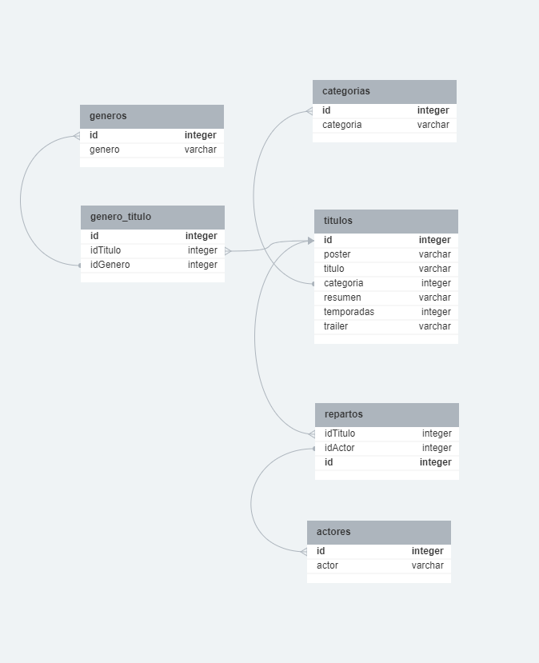

# API con NODE.JS, SEQUELIZE y MYSQL
Tercer proyecto integrador de argentina programa.
API para realizar consultas a bases de datos en mysql utlizando node.js, sequelize como orm.

## Modelo de la base de datos
Base de datos planteada para el ejercicio:


## Endpoints
Endpoints disponibles en la API. Direccion utilizada: `http://localhost:3030`

### Mostrar el catálogo completo de contenidos
- **URL** : `/catalogo`
- **Método** : `GET`
- **Respuesta exitosa**:
  - **Status Code** : 200
  - **Ejemplo de retorno**:

```
[
  {
    "id": 1,
    "poster": "/posters/1.jpg",
    "titulo": "Titulo",
    "categoria": "Serie",
    "genero": "Drama,Hechos verídicos",
    "resumen": "Resumen de serie o película.",
    "temporadas": "4",
    "reparto": "Actor A, Actor B,Actor C,Actriz A, Actor D,Actriz B",
    "trailer": ""
  }, ...]
```
